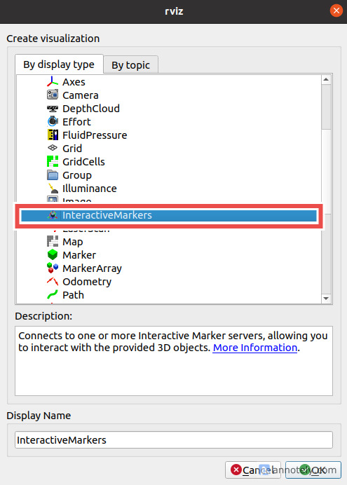

# Proyecto de practicas profesionales Primavera 2026

Estos son paquetes creados para ejecutar movimiento y modificar cosas, sin embargo, existen algunas modificaciones que deben de hacerse en el repositorio clonado propio del brazo, proveniente del repositorio oficial de [kinova-ros](https://github.com/kinovarobotics/kinova-ros).

Algunas de las modificaciones más importantes son las modificaciones realizadas para habilitar correctamente los controladores adecuados para [Moveit!](https://moveit.github.io/moveit_tutorials/), ya que existieron problemas puntuales sobre su instalación.

Para navegar fácilmente en el repositorio es conveniente, después de hacer source en el workspace, ejecutar el siguiente comando:

```bash
  roscd m1n6s300_moveit_config/launch
```

En el archivo ***m1n6s300_gazebo_demo.launch*** debemos agregar algunas líneas de código, ya que los controladores cargados para la simulación son los controladore usados por el brazo físico, a diferencia de los controladores necesarios para gazebo.


```XML
  <!-- En los argumentos agregar -->
  <arg name="gazebo_sim" default="true"/>
```

El bloque siguiente debe agregarse el argumento anterior

```XML
<!-- Se agrega la parte de gazebo_sim -->
<include file="$(find m1n6s300_moveit_config)/launch/move_group_m1n6s300.launch">
  <arg name="allow_trajectory_execution" value="true"/>
  <arg name="fake_execution" value="false"/>
  <arg name="info" value="true"/>
  <arg name="debug" value="$(arg debug)"/>
  <arg name="joint_states_ns" value="/m1n6s300/joint_states"/>
  <arg name="controller_manager" value="m1n6s300_ros_control"/>
  <arg name="gazebo_sim" value="$(arg gazebo_sim)"/>
</include> 
```

Adicional a esto se debe de realizar la instalación de las dependencias necesarias para la construcción de los paquetes

```bash
  rosdep install -y --from-paths . --ignore-src --rosdistro noetic
```
Las dependencias faltantes de versiones anteriores deben de instalarse munualmente.

Si al iniciar el rviz con moveit no se encuentra el interactor de movimiento, ejecutar el siguiente comando.

```bash
  sudo apt install ros-noetic-trac-ik-kinematics-plugin
```

Además de agregar el display necesario para los marcadores interactivos.



Otra configuración indispensable es agregar las configuraciones necesarias a los archivos xacro para poder spawnear de forma correcta las visualizaciones y configuraciones del brazo.

Refiriendonos primero al archivo [m1n6s300_standalone.xacro](https://github.com/Kinovarobotics/kinova-ros/blob/noetic-devel/kinova_description/urdf/m1n6s300_standalone.xacro) correspondiente al paquete [robot_description](https://github.com/Kinovarobotics/kinova-ros/blob/noetic-devel/kinova_description), es necesario agregar algunas configuraciones sobre la montura de la camara,  la cual se encuentra disponible en la rama [ros1-legacy](https://github.com/realsenseai/realsense-ros/tree/ros1-legacy) del repositorio correspondiente de intel realsense d415 para ros1. Este repositorio debe de ser clonado y compilado en el workspace del proyecto como paquete independiente, así como se deben instalar los drivers necesarios.

* El primer cambio es en el archivo [m1n6s300_standalone.xacro](https://github.com/Kinovarobotics/kinova-ros/blob/noetic-devel/kinova_description/urdf/m1n6s300_standalone.xacro), se debe   incluir el archivo [urdf](https://github.com/realsenseai/realsense-ros/blob/ros1-legacy/realsense2_description/urdf/_d415.urdf.xacro) de la cámara para agregar la montura visual en el brazo. La línea debe anexarse de la siguiente manera:

```XML
<?xml version="1.0"?>
<!-- m1n6_2 refers to mico v1 6DOF non-spherical 2fingers -->


<robot xmlns:xi="http://www.w3.org/2001/XInclude"
	xmlns:gazebo="http://playerstage.sourceforge.net/gazebo/xmlschema/#gz"
    xmlns:model="http://playerstage.sourceforge.net/gazebo/xmlschema/#model"
	xmlns:sensor="http://playerstage.sourceforge.net/gazebo/xmlschema/#sensor"
	xmlns:body="http://playerstage.sourceforge.net/gazebo/xmlschema/#body"
    xmlns:geom="http://playerstage.sourceforge.net/gazebo/xmlschema/#geom"
    xmlns:joint="http://playerstage.sourceforge.net/gazebo/xmlschema/#joint"
	xmlns:controller="http://playerstage.sourceforge.net/gazebo/xmlschema/#controller"
	xmlns:interface="http://playerstage.sourceforge.net/gazebo/xmlschema/#interface"
	xmlns:rendering="http://playerstage.sourceforge.net/gazebo/xmlschema/#rendering"
    xmlns:renderable="http://playerstage.sourceforge.net/gazebo/xmlschema/#renderable"
    xmlns:physics="http://playerstage.sourceforge.net/gazebo/xmlschema/#physics"
	xmlns:xacro="http://www.ros.org/wiki/xacro" name="m1n6s300">


  <xacro:include filename="$(find kinova_description)/urdf/m1n6s300.xacro"/>
  <!-- justo debajo de la inclusión del archivo xacro del brazo -->
  <xacro:include filename="$(find realsense2_description)/urdf/_d415.urdf.xacro"/>
```

Además se debe agregar las líneas para controlar el movimiento desde gazebo, así como se muestra a continuación:

```XML
  <xacro:property name="robot_root" value="root" />

  <xacro:m1n6s300  base_parent="${robot_root}"/>
  <!--Debe ir dentro de la etiqueta robot debajo de la definición de root-->
  <gazebo>
    <plugin name="gazebo_ros_control" filename="libgazebo_ros_control.so">
      <robotNamespace>/</robotNamespace>
    </plugin>
  </gazebo>
  <!--Aquí se termina el bloque que se debe ded agregar-->
</robot>

```

* El segundo cambio es en el archivo [m1n6s300.xacro](https://github.com/Kinovarobotics/kinova-ros/blob/noetic-devel/kinova_description/urdf/m1n6s300.xacro), al cual se le deben agregar tanto las monturas de la camara, como los también la integración de los tópicos que nos permitirán interactuar con los elementos necesarios.
Primero, agregamos la montura justo por debajo de la defición de links y joints, anexando esta sección de código:

```XML
<!-- Montura de la camara en la quinta articulación del brazo -->
<link name="${prefix}_d415_mount_link"/>

<joint name="${prefix}_d415_mount_joint" type="fixed">
  <parent link="${prefix}_link_5"/>
  <child link="${prefix}_d415_mount_link"/>
  <origin xyz="0.000 -0.129 0.004" rpy="3.142 0.524 -1.571"/>
</joint>

<xacro:sensor_d415
  parent="${prefix}_d415_mount_link"
  name="d415"
  use_nominal_extrinsics="true">
  <origin xyz="0 0 0" rpy="0 0 0"/>
</xacro:sensor_d415>

```

Debajo de eso, colocar los plugins necesarios para visualizar los tópicos rgb y de profundidad de la cámara.

```XML
<!-- Definición de tópicos-->

<!-- Color camera -->
<gazebo reference="d415_color_frame">
  <sensor type="camera" name="d415_color">
  <update_rate>30.0</update_rate>
  <camera name="d415_color">
      <horizontal_fov>1.2043</horizontal_fov>
      <image>
        <width>640</width>
        <height>480</height>
        <format>R8G8B8</format>
      </image>
        <clip>
          <near>0.1</near>
          <far>10.0</far>
        </clip>
  </camera>
  <plugin name="d415_color_controller" filename="libgazebo_ros_camera.so">
    <alwaysOn>true</alwaysOn>
    <updateRate>30.0</updateRate>
    <cameraName>d415/color</cameraName>
    <imageTopicName>image_raw</imageTopicName>
    <cameraInfoTopicName>camera_info</cameraInfoTopicName>
    <frameName>d415_color_optical_frame</frameName>
    <hackBaseline>0.0</hackBaseline>
    <distortionK1>0.0</distortionK1>
    <distortionK2>0.0</distortionK2>
    <distortionK3>0.0</distortionK3>
    <distortionT1>0.0</distortionT1>
    <distortionT2>0.0</distortionT2>
  </plugin>
  </sensor>
</gazebo>

<!-- Depth camera -->
<gazebo reference="d415_depth_frame">
  <sensor type="depth" name="d415_depth">
    <update_rate>30.0</update_rate>
    <camera name="d415_depth">
      <horizontal_fov>1.2043</horizontal_fov>
      <image>
        <width>640</width>
        <height>480</height>
        <format>R8G8B8</format>
      </image>
      <clip>
        <near>0.1</near>
        <far>10.0</far>
      </clip>
    </camera>
    <plugin name="d415_depth_controller" filename="libgazebo_ros_openni_kinect.so">
      <alwaysOn>true</alwaysOn>
      <updateRate>30.0</updateRate>
      <cameraName>d415</cameraName>
      <imageTopicName>depth/image_raw</imageTopicName>
      <cameraInfoTopicName>depth/camera_info</cameraInfoTopicName>
      <depthImageTopicName>depth/image_raw</depthImageTopicName>
      <depthImageCameraInfoTopicName>depth/camera_info</depthImageCameraInfoTopicName>
      <pointCloudTopicName>depth/points</pointCloudTopicName>
      <frameName>d415_depth_optical_frame</frameName>
      <pointCloudCutoff>0.1</pointCloudCutoff>
      <pointCloudCutoffMax>10.0</pointCloudCutoffMax>
      <distortionK1>0.0</distortionK1>
      <distortionK2>0.0</distortionK2>
      <distortionK3>0.0</distortionK3>
      <distortionT1>0.0</distortionT1>
      <distortionT2>0.0</distortionT2>
    </plugin>
  </sensor>
</gazebo>
```
Como cambio final, que **puede ser provisional**, es la limitación de las articulaciones 2 y 3 del brazo, esto para que Moveit no realice cambios bruscos.
#### **Cambio 1**
```XML
<!-- <xacro:property name="joint_2_lower_limit" value="${50/180*J_PI}" />
<xacro:property name="joint_2_upper_limit" value="${310/180*J_PI}" /> -->
<xacro:property name="joint_2_lower_limit" value="${151/180*J_PI}" />
<xacro:property name="joint_2_upper_limit" value="${299/180*J_PI}" />
```

#### **Cambio 2**
```XML
<!-- <xacro:property name="joint_3_lower_limit" value="${35/180*J_PI}" />
<xacro:property name="joint_3_upper_limit" value="${325/180*J_PI}" /> -->
<xacro:property name="joint_3_lower_limit" value="${52/180*J_PI}" />
<xacro:property name="joint_3_upper_limit" value="${196/180*J_PI}" />
```

### Configuraciones de la camara 
El paquete de los drivers de la camara deben de ser integrados por medio del repositorio official del [wrapper realsense-ros](https://github.com/realsenseai/realsense-ros/tree/ros1-legacy) para ros 1.

Para lanzar los nodos de la camara, se debe de ejecutar el siguiente comando, es necesario incluir ambos argumentos y es necesario destacar que durante su ejecución se visualizarán algunos errores, sin embargo, estos no determinan algún comportamiento crítico por lo que se puede continuar con normalidad.

```bash
roslaunch realsense2_camera rs_camera.launch filters:=pointcloud align_depth:=true
```

### Ejecución de rutina actual de movimiento

Para realizar la ejecución de la simulación debe tener las siguientes dependencias instaladas, en un entorno (con entornos de python es suficiente, aunque si se cree necesario se puede crear un entorno usando conda):

* numpy: versión 1.23.5
* opencv-python: versión 4.13.0.92
* ros_numpy: versión 0.0.5
* ultralytics: versión 8.4.23
* open3d: versión 0.19.0

Como parte de la preparación, debemos de agregar los modelos utilizados en Gazebo, son modelos obtenidos de [sketchfab](https://sketchfab.com/), estos deben clonarse del siguiente repositorio siguiendo los pasos que se indican en [modelos_de_gazebo](https://github.com/Ivonneperezf/modelos_de_gazebo).

Para lanzar los nodos realizar la ejecución de con los siguientes comandos:

Para lanzar el nodo con Gazebo

```bash
  roslaunch sim_kinova gazebo_kinova_sim.launch
```

a este comando se le puede agregar el argumento world para indicar que mundos cargar, por el momento los mundos disponibles son los siguientes:

```bash
world_table_aruco
world_table_bowl_with_apple
world_table_bowl
world_table_chessboard
```

puede usarse el comando el siguiente comando para lanzar cualquiera de los mundos, 

```bash
  roslaunch sim_kinova gazebo_kinova_sim.launch world:=world_table_bowl_with_apple
```

el mundo cargado por defecto es ***world_table_bowl_with_apple***.

Posteriormente, se debe de lanzar el nodo de rviz.

```bash
  roslaunch sim_kinova rviz_kinova_sim.launch
```

### Paquete de calibración

Los archivos en el paquete de calibración son necesarios ejecutar solo los scripts con `rosrun`, sin tomar en cuenta por el momento los archivos launch.